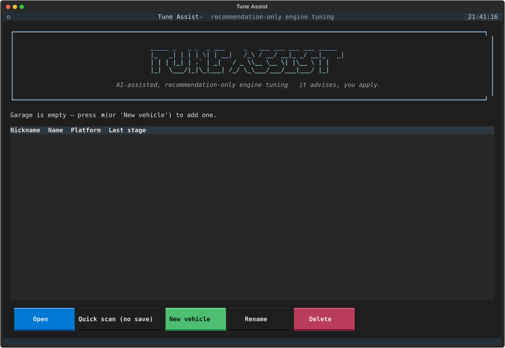
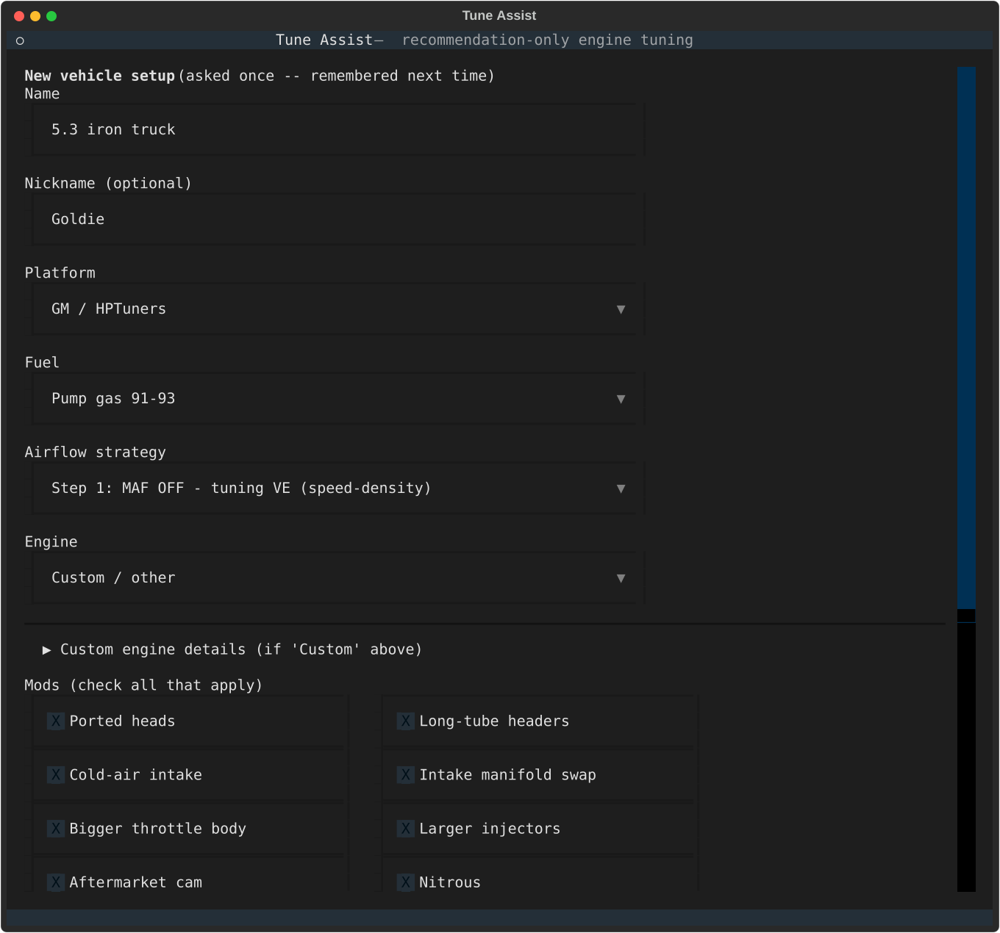
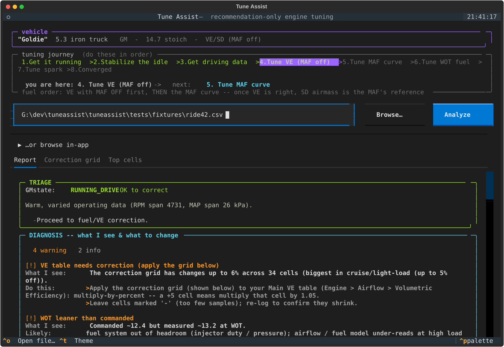
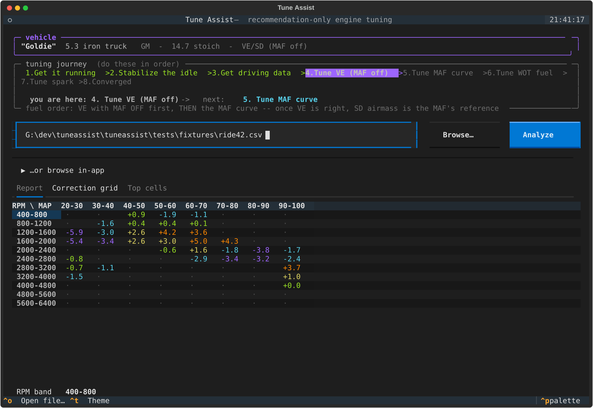

# tuneassist

**Drop in a datalog. Get told exactly what to change, where to change it, and what to do or how to drive next.**

tuneassist reads the CSV your scanner exports, checks the car is actually in a
state worth tuning, and hands back the fuel/VE changes a good tuner would make —
cell by cell, with the table name to paste them into. Then it tells you the drive
to go capture next so the tune walks forward log after log.

It reads logs and makes recommendations. **It never writes to your ECU and never
touches your tune file.** You make the changes in HP Tuners or the Holley
software yourself. You're still the tuner — this just does the math and remembers
the playbook so you don't have to chase trims with a spreadsheet.

Works with **GM / HP Tuners** (Gen 3/4 LS — P01/P59, E38/E40/E67, speed-density +
MAF) and **Holley EFI** (Terminator X, Sniper V1/V2). Built for swaps, hot rods,
and anyone tuning their own stuff. Runs **100% offline** — your logs never leave
your machine. No internet access required so you can tune on the street.

---

## What it looks like
Add your vehicle to the garage for stored state or do a quick scan. 
Pick your build out of the garage, fill in the hardware once, and it remembers
everything between sessions:

  
  

In HPTuners or Holley - open your log file, export it (as CSV but this usually happens by default)
Open Tuneassist and point it at a CSV log and it lays out the whole picture — where you are in the tune,
what's wrong in plain English, the fuel/VE correction, and the single next move:

The correction comes as the actual RPM × MAP grid you paste into your VE/fuel
table — sortable, with per-cell detail:

---

## Get it

**Easiest — grab the binary.** One file, no Python, no install. Download for your
OS from the [Releases page](https://github.com/allantaylor8907/tuneassist/releases):

| OS | File | Run it |
|---|---|---|
| Windows | `tuneassist-windows-x64.exe` | double-click it |
| macOS | `tuneassist-macos-arm64` | `chmod +x tuneassist-macos-arm64 && ./tuneassist-macos-arm64` |
| Linux | `tuneassist-linux-x64` | `chmod +x tuneassist-linux-x64 && ./tuneassist-linux-x64` |

Running it with no arguments opens the full UI. On macOS the first launch may get
blocked because it's unsigned — right-click → Open, or run
`xattr -d com.apple.quarantine ./tuneassist-macos-arm64`.

**Want a desktop icon?** One command drops a double-clickable launcher on your
desktop (`.lnk` on Windows, `.command` on macOS, `.desktop` + app-menu entry on
Linux) that opens straight into the UI:

    tuneassist --install-shortcut

**Updates happen on their own.** It quietly checks GitHub about once a day and
tells you when there's a new version. Pull it down with:

    tuneassist --update          # downloads the new build and swaps itself in
    # or just hit Ctrl+U in the UI

(Don't want it phoning home? Set `TUNEASSIST_NO_UPDATE_CHECK=1` and it never
checks. Installed from source? `--update` points you at `pipx upgrade tuneassist`.)

**From source (devs):**

    pipx install .            # or: uv tool install .   -> `tuneassist` command
    # working on it:
    pip install -r requirements.txt
    python -m tuneassist.cli --tui

---

## How to use it

First, **export your log to CSV** from the vendor software (VCM Scanner: Scan →
Export Data; Holley software: export to CSV). The native `.hpl`/`.dl` files are
raw binary with no channel names baked in — they can't be read safely, and
guessing a column on a fuel calc is how you lean a motor out. CSV only.

### The full UI (the default)

    tuneassist            # no arguments -> the full UI  (same as --tui)

Mouse and keyboard. A **garage** of your cars, a setup form, and the analysis
screen — drop in a log and get the journey bar, heatmaps, the interactive
correction grid, the spark grid, a plain-English diagnosis, and the next-step
card. **Quick scan** skips the garage for a one-off. **Ctrl+T** cycles themes
(dark by default), remembered per machine.

It keeps a garage in `~/.tuneassist/garage.json`. Each car remembers its
hardware (cam, block, compression), fuel, airflow strategy, and how far along the
tune is — so when you come back days later with the next drive's log, you pick
the truck and keep going right where you left off. Give 'em nicknames so you're
not guessing which 5.3 is which.

### The tuning journey

The whole idea is that one log isn't a tune — a tune is a dozen logs. It tracks
where you are and only ever asks for the *next* move:

    Get it running → Stabilize idle → Get driving data → Tune VE (MAF off)
      → Tune MAF curve → Tune WOT fuel → Tune spark → Converged

It runs the standard GM workflow — kill the MAF, dial the VE table in speed
density, *then* turn the MAF back on and tune its curve (the SD airmass is your
reference once VE is right). Spark is **knock-governed**: it pulls timing where
knock shows, and only adds timing toward MBT if you ask, one small step per pull.
**No knock channel logged, no timing advice. Period.**

### Prefer a plain text walkthrough?

    tuneassist --wizard            # the classic guided session, no mouse needed
    tuneassist your_log.csv        # a log path also drops you into it

Same brain, asked as a few questions in the terminal. Handy over SSH or on a
machine where the full UI won't draw right.

### Headless / scripting

    tuneassist your_log.csv --batch              # plain-text report
    tuneassist your_log.csv --json --spark       # structured JSON

The `--json` output is the stable contract — triage, the correction grid, the
cross-check, MAF/spark grids, and the prescription — for anyone who wants to
build on top of it.

### Try it in a browser (no install)

    pip install ".[serve]"
    python demo/serve.py        # http://localhost:8000

Hosts the UI in a browser with bundled sample logs, locked down so it can't see
the server's filesystem. Good for showing someone what it does.

---

## Why recommendation-only

Two reasons, and both matter. **Legal:** the vendor tune formats are closed,
there's no public API, and nobody should be reverse-engineering write access to
your ECU off a GitHub project. **Safety:** an automated tool closing the loop and
writing fuel to a running engine is how you turn a lean spot into a hole in a
piston. A human reading a recommendation and making the change is the right
amount of friction. This tool will always stop at "here's what I'd change."

---

## Built on real tuning, not vibes

The methodology here didn't come out of thin air — it's the stuff that actually
works on these platforms, distilled from people who've done it for real:

- **Kyle / [Goat Rope Garage](https://www.youtube.com/@GoatRopeGarage)** and the
  Gen 3 LSx playbook — the VE-then-MAF order, the WOT and PE rules, "never disable
  power enrichment."
- **[tuning101.com](https://tuning101.com)** and the **HP Tuners forums** — the
  airmass/SD math, the idle and knock threads, the symptoms-and-causes catalog.
- Every tuner who posted a datalog and explained what they did with it.

The full reasoning behind every decision is in [DESIGN.md](DESIGN.md).

---

## Free, and staying that way

tuneassist is MIT-licensed and free. No account, no cloud, no upsell, no log
harvesting. If it saved you a trip to the dyno or a melted piston and you want to
throw a few bucks toward more features, there's a **Sponsor** button up top —
totally optional, beer money appreciated. Stars and bug reports help just as much.

---

## Docs & tests

- [DESIGN.md](DESIGN.md) — the tuning logic and the *why* behind it.
- [CLAUDE.md](CLAUDE.md) — map of the codebase.
- Tests: `python tests/test_triage.py` (or run them all in `tests/`).

Found a log it gets wrong? Open an issue with the CSV — that's how it gets
smarter.
